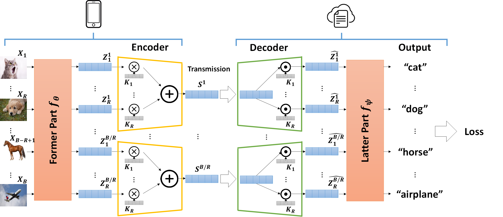

# C3-SL: Circular Convolution-Based Batch-Wise Compression for Communication-Efficient Split Learning

   This repository provides the official Pytorch implementation for **C3-SL**.
   
   [**:paperclip: Paper Link**](https://arxiv.org/abs/2207.12397)
   [**:pencil2: Citations**](#citations)
   
   <div align="center">
  
  <br><br><br>
   </div>
   
   
   
   * **Batch-Wise Compression (A new Compression Paradigm for Split Learning)**
   * **Exploit Circular Convolution and Orthogonality of features to avoid information loss**
   * **Reduce 1152x memory and 2.25x computation overhead compared to the SOTA dimension-wise compression method**
---
##  Presentation Video : [Click here](https://www.youtube.com/watch?v=FilXOXhmeOU)
[<div align="center"> </div>](https://www.youtube.com/watch?v=FilXOXhmeOU)

---


  <h2> Table of Contents</h2>
  <ul>
    <li>
      <a href="#books-prepare-dataset">Prepare Dataset</a>
      <ul>
        <!-- <li><a href="#built-with">Built With</a></li> -->
      </ul>
    </li>
    <li>
      <a href="#running-usage---training">Usage</a>
    </li>
    <li>
      <a href="https://github.com/WesleyHsieh0806/C3-SL/edit/master/README.md#chart_with_upwards_trend-experiment-overview">Experiment Overview</a>
    </li>
    <li>
      <a href="#citations">Citations</a>
    </li>
  </ul>


---

## :books: Prepare Dataset
   The source code can be found in [CIFAR-10/data preprocess src](https://github.com/WesleyHsieh0806/C3-SL/tree/master/CIFAR10/data%20preprocess%20src) and [CIFAR-100/data preprocess src](https://github.com/WesleyHsieh0806/C3-SL/tree/master/CIFAR100/data%20preprocess%20src).
   
   | Tasks | Datasets:point_down: |
   | - | - | 
   | Image Classification | [CIFAR-10](https://www.google.com/search?q=cifar+10&oq=cifar+10&aqs=chrome..69i57j0i512l4j69i60l3.4031j0j4&sourceid=chrome&ie=UTF-8), [CIFAR-100](https://www.google.com/search?q=cifar+10&oq=cifar+10&aqs=chrome..69i57j0i512l4j69i60l3.4031j0j4&sourceid=chrome&ie=UTF-8)|
   
   * Use the following commands:
   ```bash
   $ cd CIFAR10  # or cd CIFAR100
   $ cd "data preprocess src"    
   $ python download_data.py
   ```
   
   * The data structure should be formatted like this:
   ```
   CIFAR10(Current dir)
   ├──CIFAR
   │   ├── train
   │   ├── val
   ├──data preprocess src
   │   ├── download_data.py
   ```
   


## :running: Usage - Training
### Requirements
* Python 3.6
* Pytorch 1.4.0
* torchvision
* CUDA 10.2
* tensorflow_datasets
* Other dependencies: numpy, matplotlib, tensorflow
   

### Training

Modify parameters in the [shell script](https://github.com/WesleyHsieh0806/C3-SL/blob/master/CIFAR100/C3-SL/train.sh).

| Parameters | Definition |
| - | - | 
| --batch | batch size |
| --epoch | number of training epochs |  
| --dump_path | save path of experiment logs and checkpoints |
| --arch | model architecture (resnet50/vgg16) |
| --split | the split point of model |
| --bcr | Batch Compression Ratio **R** |


```bash
cd CIFAR10/C3-SL
./train.sh
```


## :chart_with_upwards_trend: Experiment Overview
* Comparable Accuracy with SOTA
* Greatly Reduce Resource Overhead

<div align="center">
  
  <br><br><br>
   </div>


## Citations
``` bash
@article{hsieh2022c3,
  title={C3-SL: Circular Convolution-Based Batch-Wise Compression for Communication-Efficient Split Learning},
  author={Hsieh, Cheng-Yen and Chuang, Yu-Chuan and others},
  journal={arXiv preprint arXiv:2207.12397},
  year={2022}
}
```
